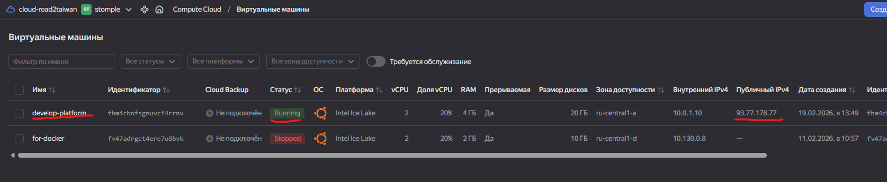
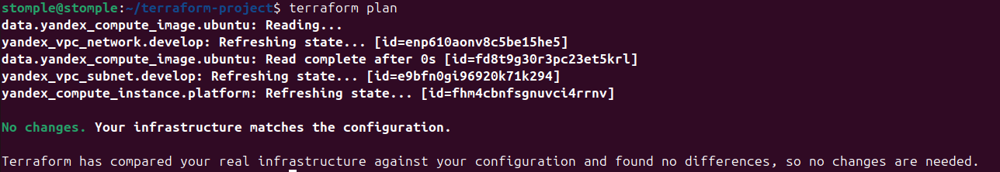
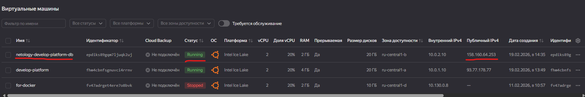
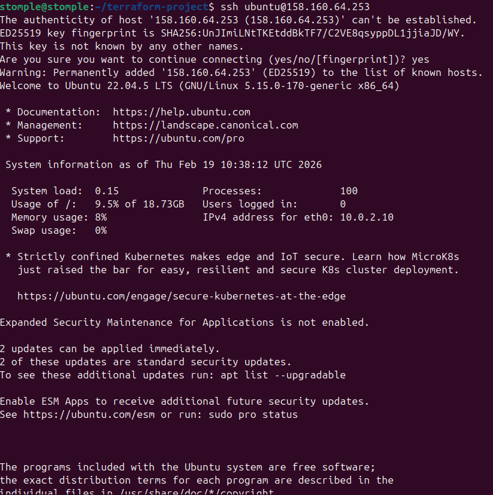
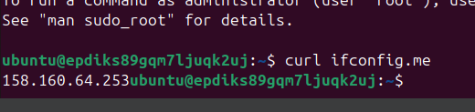
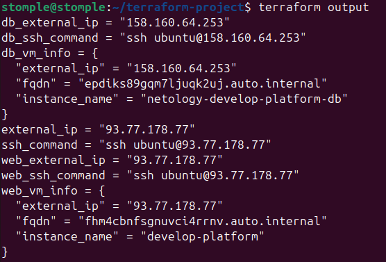
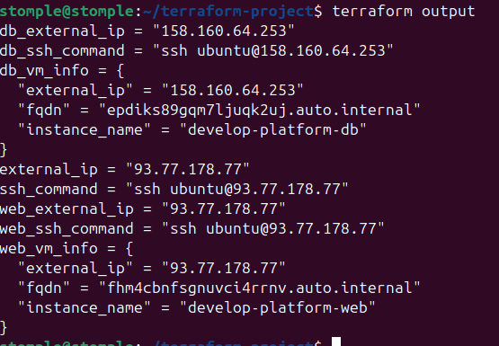

# Домашнее задание к занятию «Основы Terraform. Yandex Cloud» Соколов Тимофей

### Цели задания

1. Создать свои ресурсы в облаке Yandex Cloud с помощью Terraform.
2. Освоить работу с переменными Terraform.


### Чек-лист готовности к домашнему заданию

1. Зарегистрирован аккаунт в Yandex Cloud. Использован промокод на грант.
2. Установлен инструмент Yandex CLI.
3. Исходный код для выполнения задания расположен в директории [**02/src**](https://github.com/netology-code/ter-homeworks/tree/main/02/src).


### Задание 0

1. Ознакомьтесь с [документацией к security-groups в Yandex Cloud](https://cloud.yandex.ru/docs/vpc/concepts/security-groups?from=int-console-help-center-or-nav). 
Этот функционал понадобится к следующей лекции.

------
### Внимание!! Обязательно предоставляем на проверку получившийся код в виде ссылки на ваш github-репозиторий!
------

### Задание 1
В качестве ответа всегда полностью прикладывайте ваш terraform-код в git.
Убедитесь что ваша версия **Terraform** ~>1.12.0

1. Изучите проект. В файле variables.tf объявлены переменные для Yandex provider.
2. Создайте сервисный аккаунт и ключ. [service_account_key_file](https://terraform-provider.yandexcloud.net).
4. Сгенерируйте новый или используйте свой текущий ssh-ключ. Запишите его открытую(public) часть в переменную **vms_ssh_public_root_key**.
5. Инициализируйте проект, выполните код. Исправьте намеренно допущенные синтаксические ошибки. Ищите внимательно, посимвольно. Ответьте, в чём заключается их суть.
6. Подключитесь к консоли ВМ через ssh и выполните команду ``` curl ifconfig.me```.
Примечание: К OS ubuntu "out of a box, те из коробки" необходимо подключаться под пользователем ubuntu: ```"ssh ubuntu@vm_ip_address"```. Предварительно убедитесь, что ваш ключ добавлен в ssh-агент: ```eval $(ssh-agent) && ssh-add``` Вы познакомитесь с тем как при создании ВМ создать своего пользователя в блоке metadata в следующей лекции.;
8. Ответьте, как в процессе обучения могут пригодиться параметры ```preemptible = true``` и ```core_fraction=5``` в параметрах ВМ.

В качестве решения приложите:

- скриншот ЛК Yandex Cloud с созданной ВМ, где видно внешний ip-адрес;
- скриншот консоли, curl должен отобразить тот же внешний ip-адрес;
- ответы на вопросы.




Обнаруженные траблы:
1) Неправильное имя переменной для ssh ключа. В variables.tf переменная называлась vms_ssh_root_key, а в main.tf - vms_ssh_public_root_key. Исправил на правильное имя.
2) В провайдере забыли указать зону. В блоке provider "yandex" не было строчки zone = var.default_zone. Без этого terr не знал, в какой зоне работать. Добавил.
3) core_fraction стоял не на своем месте. Параметр core_fraction = 5 был написан отдельно, хотя должен быть внутри блока resources. Перенес куда надо.
4) Для платформы standard-v3 нельзя ставить core_fraction = 5. Оказалось, что для этой платформы разрешены только значения 20, 50 и 100. Поставил 20 — работает.
5) Метаданные были криво оформлены. Неправильно передавался ssh ключ через cloud-init. Поправил формат, теперь ключ нормально подкладывается в вм.

preemptible = true - это когда вм дешевая, но ее могут в любой момент выключить.
В учебе это супер полезно:
- Экономит деньги, разница в 4-5 раз
- Можно запустить сразу несколько вм для экспериментов и не разориться
- Если вм выключат - учишься быстро все восстанавливать

core_fraction = 5 - это сколько процессора гарантированно дают вм .
В учебе это тоже круто:
- Пока вм просто стоит и ждет команд, она почти не жрет ресурсы
- Если надо - может кратковременно "выстрелить" и работать быстрее
- Позволяет запихнуть много учебных вм на один аккаунт

Вместе они дают возможность, например, поднять небольшой кластер kubernetes из 3-5 машин и изучать его, тратя копейки. Без них за такие эксперименты пришлось бы платить как за полноценный продакшен.

### Задание 2

1. Замените все хардкод-**значения** для ресурсов **yandex_compute_image** и **yandex_compute_instance** на **отдельные** переменные. К названиям переменных ВМ добавьте в начало префикс **vm_web_** .  Пример: **vm_web_name**.
2. Объявите нужные переменные в файле variables.tf, обязательно указывайте тип переменной. Заполните их **default** прежними значениями из main.tf. 
3. Проверьте terraform plan. Изменений быть не должно. 



### Задание 3

1. Создайте в корне проекта файл 'vms_platform.tf' . Перенесите в него все переменные первой ВМ.
2. Скопируйте блок ресурса и создайте с его помощью вторую ВМ в файле main.tf: **"netology-develop-platform-db"** ,  ```cores  = 2, memory = 2, core_fraction = 20```. Объявите её переменные с префиксом **vm_db_** в том же файле ('vms_platform.tf').  ВМ должна работать в зоне "ru-central1-b"
3. Примените изменения.





### Задание 4

1. Объявите в файле outputs.tf **один** output , содержащий: instance_name, external_ip, fqdn для каждой из ВМ в удобном лично для вас формате.(без хардкода!!!)
2. Примените изменения.

В качестве решения приложите вывод значений ip-адресов команды ```terraform output```.



### Задание 5

1. В файле locals.tf опишите в **одном** local-блоке имя каждой ВМ, используйте интерполяцию ${..} с НЕСКОЛЬКИМИ переменными по примеру из лекции.
2. Замените переменные внутри ресурса ВМ на созданные вами local-переменные.
3. Примените изменения.



### Задание 6

1. Вместо использования трёх переменных  ".._cores",".._memory",".._core_fraction" в блоке  resources {...}, объедините их в единую map-переменную **vms_resources** и  внутри неё конфиги обеих ВМ в виде вложенного map(object).  
   ```
   пример из terraform.tfvars:
   vms_resources = {
     web={
       cores=2
       memory=2
       core_fraction=5
       hdd_size=10
       hdd_type="network-hdd"
       ...
     },
     db= {
       cores=2
       memory=4
       core_fraction=20
       hdd_size=10
       hdd_type="network-ssd"
       ...
     }
   }
   ```
3. Создайте и используйте отдельную map(object) переменную для блока metadata, она должна быть общая для всех ваших ВМ.
   ```
   пример из terraform.tfvars:
   metadata = {
     serial-port-enable = 1
     ssh-keys           = "ubuntu:ssh-ed25519 AAAAC..."
   }
   ```  
  
5. Найдите и закоментируйте все, более не используемые переменные проекта.
6. Проверьте terraform plan. Изменений быть не должно.


stomple@stomple:~/terraform-project$ terraform plan
data.yandex_compute_image.ubuntu: Reading...
yandex_vpc_network.develop: Refreshing state... [id=enp610aonv8c5be15he5]
data.yandex_compute_image.ubuntu: Read complete after 1s [id=fd8t9g30r3pc23et5krl]
yandex_vpc_subnet.develop_b: Refreshing state... [id=e2ls6ejdprlc9p2d6ppo]
yandex_vpc_subnet.develop: Refreshing state... [id=e9bfn0gi96920k71k294]
yandex_compute_instance.db: Refreshing state... [id=epdiks89gqm7ljuqk2uj]
yandex_compute_instance.platform: Refreshing state... [id=fhm4cbnfsgnuvci4rrnv]

Terraform used the selected providers to generate the following execution plan. Resource actions are indicated with the following symbols:
  ~ update in-place

Terraform will perform the following actions:

  # yandex_compute_instance.db will be updated in-place
  ~ resource "yandex_compute_instance" "db" {
        id                        = "epdiks89gqm7ljuqk2uj"
      ~ metadata                  = {
          + "serial-port-enable" = "1"
          + "ssh-keys"           = "ubuntu:ssh-ed25519 AAAAC3NzaC1lZDI1NTE5AAAAIK4axl0229XBuXTl4/CW6syldFpZ4Xk2UkW7G/lX0hzC ubuntu"
          - "user-data"          = <<-EOT
                #cloud-config
                users:
                  - name: ubuntu
                    ssh-authorized-keys:
                      - ssh-ed25519 AAAAC3NzaC1lZDI1NTE5AAAAIK4axl0229XBuXTl4/CW6syldFpZ4Xk2UkW7G/lX0hzC ubuntu
                    sudo: ['ALL=(ALL) NOPASSWD:ALL']
                    groups: sudo
                    shell: /bin/bash
                package_update: true
                packages:
                  - curl
                  - htop
            EOT -> null
        }
        name                      = "develop-platform-db"
        # (14 unchanged attributes hidden)

        # (6 unchanged blocks hidden)
    }

  # yandex_compute_instance.platform will be updated in-place
  ~ resource "yandex_compute_instance" "platform" {
        id                        = "fhm4cbnfsgnuvci4rrnv"
      ~ metadata                  = {
          + "serial-port-enable" = "1"
          + "ssh-keys"           = "ubuntu:ssh-ed25519 AAAAC3NzaC1lZDI1NTE5AAAAIK4axl0229XBuXTl4/CW6syldFpZ4Xk2UkW7G/lX0hzC ubuntu"
          - "user-data"          = <<-EOT
                #cloud-config
                users:
                  - name: ubuntu
                    ssh-authorized-keys:
                      - ssh-ed25519 AAAAC3NzaC1lZDI1NTE5AAAAIK4axl0229XBuXTl4/CW6syldFpZ4Xk2UkW7G/lX0hzC ubuntu
                    sudo: ['ALL=(ALL) NOPASSWD:ALL']
                    groups: sudo
                    shell: /bin/bash
                package_update: true
                packages:
                  - curl
                  - htop
            EOT -> null
        }
        name                      = "develop-platform-web"
        # (14 unchanged attributes hidden)

        # (6 unchanged blocks hidden)
    }

Plan: 0 to add, 2 to change, 0 to destroy.

───────────────────────────────────────────────────────────────────────────────────────────────────────────────────────────────────────────────────────────────────────────────────────

Note: You didn't use the -out option to save this plan, so Terraform can't guarantee to take exactly these actions if you run "terraform apply" now.


------
